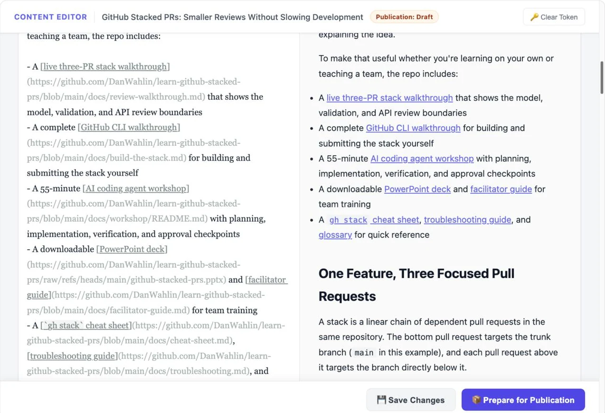

# Markdown Content Editor

<p align="center">
  
</p>

A lightweight browser-based Markdown editor for reviewing files that already live on the same machine as the server. It combines editing, rendered preview, draft controls, image previews, and optional Notion review status in one focused interface.

## How It Works

1. An editor URL supplies the absolute Markdown file path as a Base64-encoded `p` parameter
2. The server canonicalizes that path and verifies it against explicitly configured content directories
3. The browser edits and previews that one existing Markdown file

The app does not browse directories, run Git commands, publish content, or deploy a site.

<p align="center">
  
</p>

## Features

- Edit and preview Markdown side by side
- Responsive workspace that expands to fit large desktop displays
- Restrict access to explicit content directories and Markdown file extensions
- Save changes with bearer-token authentication
- Change Astro frontmatter from `draft: true` to `draft: false` without committing or deploying
- Sanitize rendered Markdown with DOMPurify
- Preview root-relative blog images from a configured public directory
- Optionally read and update review status in Notion
- Run locally or as a small self-hosted service

## Requirements

- [Node.js](https://nodejs.org/) 20.6 or newer
- npm
- One or more local directories containing the Markdown files you want to edit
- Browser access to `unpkg.com`, which serves integrity-pinned EasyMDE and DOMPurify assets

## Quick Start

1. Clone the repository and install dependencies:

   ```sh
   git clone https://github.com/DanWahlin/markdown-content-editor.git
   cd markdown-content-editor
   npm ci
   ```

2. Create the local environment file.

   macOS/Linux:

   ```sh
   cp .env.example .env
   ```

   PowerShell:

   ```powershell
   Copy-Item .env.example .env
   ```

3. Generate a strong editor token:

   ```sh
   node -e "console.log(require('crypto').randomBytes(32).toString('hex'))"
   ```

4. Edit `.env` and use absolute paths:

   ```dotenv
   PORT=18793
   HOST=127.0.0.1
   EDITOR_TOKEN=paste-the-generated-value-here
   EDITOR_ALLOWED_PREFIXES=/absolute/path/to/your/content
   EDITOR_PUBLIC_DIR=/absolute/path/to/your/site/public
   NOTION_ACCESS_TOKEN=
   ```

5. Build and start the server:

   ```sh
   npm run build
   npm run start:env
   ```

6. Generate an editor URL for an existing Markdown file:

   ```sh
   node -e "const p=Buffer.from(process.argv[1]).toString('base64'); console.log('http://localhost:18793/?p='+encodeURIComponent(p))" "/absolute/path/to/your/content/post.md"
   ```

Open the printed URL. Reading is available immediately. The first save or review action asks for `EDITOR_TOKEN`. By default the token stays only in that browser tab's session storage. Select **Remember on this device** to keep it in that browser's local storage until **Clear Token** is selected. Do not persist the token on a shared device.

## Configuration

| Variable | Required | Purpose |
| --- | --- | --- |
| `PORT` | No | HTTP port. Defaults to `18793` |
| `HOST` | No | Bind address. Defaults to `127.0.0.1`; set a broader address only when a trusted proxy requires it |
| `EDITOR_TOKEN` | For writes | Protects save, publication-preparation, and review endpoints. Writes are disabled when missing |
| `EDITOR_ALLOWED_PREFIXES` | Yes | Content directories the editor may access. Separate paths with `:` on macOS/Linux or `;` on Windows |
| `EDITOR_PUBLIC_DIR` | For image previews | Public site directory used to resolve `/images/blog/...` images |
| `NOTION_ACCESS_TOKEN` | For Notion | Enables Notion review status when a URL contains a `notion` page ID |

The server refuses to start without `EDITOR_ALLOWED_PREFIXES`.

## URL Parameters

| Parameter | Purpose |
| --- | --- |
| `p` | Base64-encoded absolute path to an existing `.md`, `.markdown`, or `.mdx` file |
| `notion` | Optional 32-character hex or dashed UUID for a Notion page |

```text
http://localhost:18793/?p=BASE64_PATH&notion=NOTION_PAGE_ID
```

Base64 is encoding, not encryption. Absolute paths and Notion IDs can appear in browser history, copied URLs, and proxy logs. The app sends `Referrer-Policy: no-referrer`, but operators should also redact query strings from access logs.

## Optional Notion Integration

When `notion` is present and `NOTION_ACCESS_TOKEN` is configured, the editor:

- Reads the page's `Status` select property
- Writes `Status` using the exact options `Approved`, `Needs Revision`, or `Denied`
- Optionally writes a `Feedback` rich-text property

It does not load existing feedback or clear feedback when an empty value is submitted. Share the target page with your Notion integration before using this feature. Without a `notion` parameter, review controls are hidden.

## Image Previews

Markdown image URLs beginning with `/images/blog/` are served from:

```text
EDITOR_PUBLIC_DIR/images/blog/
```

Allowed formats are AVIF, GIF, JPEG, PNG, and WebP. SVG is intentionally blocked because it can contain active content. Canonical-path checks prevent traversal and symlink escapes outside the configured image directory.

A sidecar cover named `<markdown-filename>-cover.webp` is displayed when it exists beside the Markdown file and resolves inside an allowed content directory.

## Security

This app reads local content and can overwrite existing Markdown files after token authentication. Treat it as an internal authoring tool, not an internet-facing multi-user CMS.

- Keep `EDITOR_ALLOWED_PREFIXES` as narrow as possible
- Use a long, randomly generated `EDITOR_TOKEN`
- Never commit `.env` or another secrets file
- Put remote deployments behind HTTPS and an identity-aware proxy such as Cloudflare Access
- Read routes have no application-level authentication; the outer access proxy must protect the complete app
- Run the service as a dedicated account with access only to required content
- Keep the default `HOST=127.0.0.1` unless a trusted local proxy needs a different binding
- Do not expose the Node.js port directly to the public internet

### Optional Cloudflare Zero Trust deployment

For a self-hosted web application, [Cloudflare Zero Trust](https://developers.cloudflare.com/cloudflare-one/) can provide an additional security layer:

- [Cloudflare Tunnel](https://developers.cloudflare.com/cloudflare-one/connections/connect-networks/) creates an outbound-only connection to Cloudflare, so the origin does not need a publicly exposed inbound application port
- [Cloudflare Access](https://developers.cloudflare.com/cloudflare-one/access-controls/applications/http-apps/self-hosted-public-app/) applies identity and access policies before requests reach the origin
- HTTPS terminates at Cloudflare while the origin service can remain private and bound to an internal or loopback address

A typical request path is:

```text
Browser → Cloudflare Access policy → Cloudflare Tunnel → private origin
```

Cloudflare Zero Trust is optional. If you use it, configure an Access policy for every application route and keep the origin unavailable through any alternate public path.

The server accepts only existing Markdown files, rejects symlink escapes, blocks active SVG responses, sanitizes preview HTML, uses integrity-pinned frontend dependencies, and sends restrictive browser security headers. The editor token is session-only by default. Users may explicitly persist it in local browser storage for a trusted device and can remove it with **Clear Token**.

## API

| Method | Route | Application authentication | Purpose |
| --- | --- | --- | --- |
| `GET` | `/` | None | Serve the editor UI |
| `GET` | `/api/file?p=...` | None | Read an allowed Markdown file |
| `POST` | `/api/save` | Bearer token | Overwrite an existing Markdown file |
| `POST` | `/api/prepare-publication` | Bearer token | Set Astro `draft` frontmatter to `false` and save |
| `GET` | `/api/review?notion_id=...` | Bearer token | Read Notion review status |
| `POST` | `/api/review` | Bearer token | Update Notion status and optional feedback |
| `GET` | `/api/cover?p=...` | None | Read an allowed sidecar WebP cover |
| `GET` | `/images/blog/*` | None | Serve allowed preview images |

The identity-aware proxy described in [Security](#security) is an operator requirement and is not included in the application.

Save and publication-preparation requests use:

```json
{
  "p": "BASE64_PATH",
  "content": "# Updated Markdown"
}
```

Review updates use:

```json
{
  "notion_id": "11111111-2222-3333-4444-555555555555",
  "status": "Needs Revision",
  "feedback": "Clarify the setup section"
}
```

Common responses include `400` for invalid input, `401` for an invalid token, `403` for a disallowed path or file type, `404` for a missing file, `502` for a Notion API failure, and `503` for missing server credentials. Express's default JSON body limit is approximately 100 KB.

## Linux Deployment with systemd

[`deploy/markdown-content-editor.service`](deploy/markdown-content-editor.service) is a hardened starting point. It assumes:

- Application: `/opt/markdown-content-editor`
- Environment file: `/etc/markdown-content-editor.env`
- Content: `/srv/content`
- Service account: `markdown-content-editor`
- Node binary: `/usr/bin/node`

From a fresh Linux machine:

```sh
sudo useradd --system --home /opt/markdown-content-editor --shell /usr/sbin/nologin markdown-content-editor
sudo mkdir -p /opt/markdown-content-editor /srv/content
sudo chown -R markdown-content-editor:markdown-content-editor /opt/markdown-content-editor /srv/content
sudo cp -R . /opt/markdown-content-editor/
cd /opt/markdown-content-editor
sudo -u markdown-content-editor npm ci
sudo -u markdown-content-editor npm run build
sudo cp .env.example /etc/markdown-content-editor.env
sudo chmod 600 /etc/markdown-content-editor.env
sudoedit /etc/markdown-content-editor.env
command -v node
sudo cp deploy/markdown-content-editor.service /etc/systemd/system/markdown-content-editor.service
sudo systemctl daemon-reload
sudo systemctl enable --now markdown-content-editor
sudo systemctl status markdown-content-editor
sudo journalctl -u markdown-content-editor -n 50 --no-pager
```

Confirm that `command -v node` matches the unit's `ExecStart`. Every writable allowed prefix needs a matching `ReadWritePaths=` entry in the service file. Put a TLS and identity-aware reverse proxy in front of the loopback service rather than changing `HOST` unless your deployment architecture requires it.

## Limitations

- Opens one existing file from a URL; there is no file browser
- Overwrites the complete file with no locking, conflict detection, version history, backup, or atomic-save guarantee
- Has no Git commit, push, branch, pull-request, publication, or deployment automation
- Has no multi-user authorization model
- Leaves read routes unauthenticated at the application layer
- Requires `unpkg.com`; there is no offline asset bundle
- Rewrites only `/images/blog/` root-relative preview paths
- Requires Astro frontmatter with an existing boolean `draft` field for publication preparation

## Development

```sh
npm run dev
npm test
npm run build
```

The development command uses environment variables exported by your shell. To load `.env`, build and use `npm run start:env`.

## Project Structure

```text
src/server.ts              Express server and API
templates/editor.html      Editor UI, styling, and browser logic
tests/server.test.ts       API, security, and layout tests
deploy/                    Example production service configuration
```

## License

[MIT](LICENSE)
